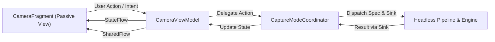

# Darkbag 核心架构解耦与状态驱动 UDF 设计规范 (不可变纲领)
**Darkbag Architecture Decoupling & State-Driven UDF Blueprint**

> **文档属性**：指导性不可变设计纲领（Immutable Architecture Blueprint）  
> **制定日期**：2026-10-08  
> **核心目标**：彻底解决 6,200+ 行 `CameraFragment` 耦合、35+ 散装参数爆炸、拍摄模式与计算管线交织的历史负债，建立**“拍摄不关心产出”**的高内聚、低耦合、状态驱动的现代相机系统架构。

---

## 一、 架构背景与现状负债分析

### 1. 核心问题定位
Darkbag 经历了 GPU 计算管线迁移、Fast Path JPEG 优化以及多种自研调色引擎后，性能指标有了质的飞跃（首张出片 T2 降至 1.8s 以内）。然而，快速迭代积累了严重的架构腐化：

1. **参数爆炸（Parameter Explosion / Data Clump）**：
   - 从 `CameraFragment` 到 `HdrPlusProcessingService`、`HdrPlusJNI` 及 C++ `ColorPipe`，函数签名常态化传递 **35~40 个松散原始参数**（`whiteLevel`, `blackLevelPattern`, `lsc`, `ccm`, `wb`, `colorMatrix1/2`, `forwardMatrix1/2`, `hfMetadata`, `pfdJpg`, `pfdDng` 等）。
   - 任何新增特性都需要在整个跨语言调用链路上进行“穿透式修改”。
2. **上帝类耦合（God Fragment Antipattern）**：
   - `CameraFragment.kt` 膨胀至 **6,277 行**。
   - Camera2 硬件流生命周期、TextureView / Surface 渲染、手势触摸、UI 按钮旋转动画、半格模式/多摄模式逻辑、MediaStore 媒体库插入与缓存管理混杂一处。
3. **控制反转破坏与假设越权（Inversion of Control Violation）**：
   - 核心处理服务（`HdrPlusProcessingService`）越权假设“所有拍摄产物必须即时以公开单张 JPEG 形式写入系统相册 MediaStore”，并在底层写死 PFD 流程。
   - 此假设直接击穿了**半格模式**（需要拍摄两帧并在应用内部拼接后方可发布）和**多摄同拍模式**的业务契约。

---

## 二、 核心架构设计原则（不可变约束）

在后续的所有重构阶段中，必须严格恪守以下四大设计原则，杜绝目标偏移：

```
                    ┌────────────────────────────────────────────────────────┐
                    │ 原则 1: 拍摄不关心产出 (Pipeline Agnostic Output)         │
                    │   管线只产出 Buffer/ImageRef，由 CaptureSink 决定消费   │
                    └───────────────────────────┬────────────────────────────┘
                                                │
                    ┌───────────────────────────┴────────────────────────────┐
                    │ 原则 2: 参数生命周期正交化 (Three-Tier Context Aggregation)│
                    │   静态硬件标定、动态曝光元数据、调色意图物理分离            │
                    └───────────────────────────┬────────────────────────────┘
                                                │
                    ┌───────────────────────────┴────────────────────────────┐
                    │ 原则 3: 策略模式隔离业务 (Mode Coordinator Engine)        │
                    │   半格/多摄逻辑独立自治，管线与 UI 完全不知晓其存在         │
                    └───────────────────────────┬────────────────────────────┘
                                                │
                    ┌───────────────────────────┴────────────────────────────┐
                    │ 原则 4: 单向数据流与无头引擎 (UDF & Headless Engine)      │
                    │   UI 纯被动消费 StateFlow，Camera2 硬件下沉独立控制器     │
                    └────────────────────────────────────────────────────────┘
```

### 原则 1：拍摄不关心产出（Pipeline Agnostic Output）
- **核心契约**：计算与调色管线（无论是 HDR+ 多帧、Single RAW 还是 Sabre 超分辨率）只负责将传感器数据解算并调色为高质量图像数据（`RenderedFrame` / `RawBundle`）。
- **完全解耦**：管线绝对不直接依赖 `MediaStore`、`ContentResolver`、私有缓存文件路径或任何特定拍摄模式的标志。产物的落盘、拼接、多摄同步完全由外部注入的 **`CaptureSink`** 策略消费。

### 原则 2：参数生命周期正交化（Three-Tier Context Aggregation）
将 35+ 个散装参数按其**物理生命周期与所属领域**正交化拆解为 3 个聚合对象：
1. **`HardwareProfile`（静态会话级标定）**：镜头硬件物理常数（白电平、黑电平、CFA、色彩校准矩阵、物理尺寸）。在镜头切换（Camera ID 变更）时构建并在 Session 内缓存，禁止每次快门重复跨 JNI 传递。
2. **`CaptureFrameMetadata`（单次抓帧物理状态）**：每一帧曝光的动态物理量（曝光时间、实际 ISO、LSC GainMap、动态黑电平）。
3. **`RenderRecipe`（渲染与调色意图）**：用户的后处理意志（LUT 纹理、饱和度/对比度、Log 模式、数字增益、裁剪比例）。

### 原则 3：模式协调器策略模式（Mode Coordinator Engine）
- 半格模式、多摄模式、连拍模式各为独立的 **`CaptureModeCoordinator`**。
- 所有模式特异的状态转移（例如半格模式的 `Frame 1 缓存 -> Frame 2 触发 -> 双帧拼合`）完全由对应的协调器自包含驱动。UI 控件与计算管线无需关心也不允许存在 `if (isHalfFrame)` 侵入式判断。

### 原则 4：单向数据流与硬件无头化（UDF & Headless Engine）
- **View 层纯被动**：`CameraFragment` 仅作为 Passive View，仅负责将触摸/按键转化为 `CameraIntent`，并根据 `StateFlow<CameraUiState>` 渲染控件，根据 `SharedFlow<CameraEffect>` 执行瞬态动画。
- **硬件流无头化**：Camera2 的设备打开、会话配置、Repeating Request 循环抽取为无头的 `Camera2SessionController`，不持有 View 引用，彻底规避配置变更（旋转屏幕）时的生命周期泄漏。

---

## 三、 核心领域抽象与接口规范

### 1. 产物交付抽象（CaptureSink 体系）
```kotlin
package top.maary.darkbag.pipeline.sink

/**
 * 拍摄管线交付产物的核心契约。
 * 计算管线生产完成后通过此接口交付，不关心图像最终去向。
 */
interface CaptureSink {
    /** 当已渲染/调色的高质量图像（JPEG 数据流或共享内存 Buffer）就绪时调用 */
    fun onImageRendered(buffer: RenderedImageBuffer, metadata: OutputMetadata)

    /** 当 RAW 格式产物（DNG 句柄或文件）就绪时调用 (可选) */
    fun onRawProduced(rawBundle: RawOutputBundle?, metadata: OutputMetadata)

    /** 异常或中断通知 */
    fun onError(error: PipelineError)
}
```

#### 经典 Sink 消费策略：
1. **`DirectMediaStoreSink`（普通模式）**：
   - 申请 MediaStore Pending PFD，流式直写，实现零拷贝亚秒级落盘。
2. **`HalfFrameCacheSink`（半格模式）**：
   - Frame 1：将渲染帧写入私有临时缓存，更新本地会话，**不向 MediaStore 写入任何数据**；
   - Frame 2：读取 Frame 1 缓存，执行高保真拼接，渲染排版边框与时间戳，最后统一写入 MediaStore。
3. **`MultiCameraSyncSink`（多摄同拍）**：
   - 等待前置与后置（或广角与长焦）双帧全部抵达后，进行时间戳对齐与成对入库。

---

### 2. 领域参数对象模型（Parameter Aggregates）
```kotlin
package top.maary.darkbag.pipeline.model

/** 1. 镜头硬件物理常数 (Session 级长生命周期) */
data class HardwareProfile(
    val lensId: String,
    val cfaPattern: Int,
    val whiteLevel: Int,
    val blackLevelPattern: IntArray,
    val colorMatrix1: FloatArray,
    val colorMatrix2: FloatArray,
    val forwardMatrix1: FloatArray,
    val forwardMatrix2: FloatArray,
    val calibrationIlluminant1: Int,
    val calibrationIlluminant2: Int,
    val activeArray: IntArray?
)

/** 2. 动态抓帧物理参数 (单次曝光级) */
data class CaptureFrameMetadata(
    val timestamp: Long,
    val iso: Int,
    val exposureTimeNs: Long,
    val lensShadingMap: FloatArray?,
    val lensShadingRows: Int,
    val lensShadingCols: Int,
    val whiteBalanceGains: FloatArray,
    val colorCorrectionTransform: FloatArray,
    val postRawSensitivityBoost: Float = 1.0f
)

/** 3. 渲染调色配方 (纯数学后处理意图) */
data class RenderRecipe(
    val targetLogIndex: Int = 0,
    val lutPath: String? = null,
    val digitalGain: Float = 1.0f,
    val exposureBias: Float = 0.0f,
    val contrast: Float = 0.0f,
    val saturation: Float = 0.0f,
    val highlights: Float = 0.0f,
    val shadows: Float = 0.0f,
    val whites: Float = 0.0f,
    val blacks: Float = 0.0f,
    val colorEngineMode: Int = 2,
    val faithfulHighlights: Boolean = false
)

/** 4. 完整的拍摄任务规格 */
data class CaptureTaskSpec(
    val taskId: String,
    val hardwareProfile: HardwareProfile,
    val frameMetadata: CaptureFrameMetadata,
    val renderRecipe: RenderRecipe,
    val sink: CaptureSink
)
```

---

### 3. 模式协调器架构（Mode Coordinator Engine）
```kotlin
package top.maary.darkbag.modes

interface CaptureModeCoordinator {
    /** 模式名称与标识 */
    val modeId: CaptureMode

    /** 响应用户按下快门动作 */
    fun onShutterTriggered(context: ModeExecutionContext)

    /** 进入此模式时的初始化 (如配置辅助取景器参考线) */
    fun onActivated()

    /** 退出此模式时的清理 (如清理未完成的拼接暂存) */
    fun onDeactivated()
}
```

- **`NormalModeCoordinator`**：构造 `DirectMediaStoreSink`，直接触发管线。
- **`HalfFrameModeCoordinator`**：自包含双帧状态机：
  ```
  [IDLE] ──(快门 1)──► [FRAME_1_CAPTURED (存缓存, 更新 UI: 1/2)] ──(快门 2)──► [STITCHING] ──► [PUBLISHED (回 IDLE)]
  ```

---

### 4. 状态驱动 UI 模型（UDF / MVI）



#### 持久状态与瞬态事件分离：
```kotlin
// 持久可观察状态：驱动控件可见性、高亮、角标、计数
data class CameraUiState(
    val activeLens: Lens = Lens.WIDE,
    val currentMode: CaptureMode = CaptureMode.NORMAL,
    val zoomRatio: Float = 1.0f,
    val isProcessing: Boolean = false,
    val pendingTasksCount: Int = 0,
    val latestThumbnailUri: Uri? = null,
    val halfFrameStep: Int = 0 // 0: 待拍第 1 帧, 1: 待拍第 2 帧
)

// 瞬态单次事件：驱动动效、触感震动、音效 (消费即丢弃，屏幕旋转不重放)
sealed interface CameraEffect {
    object ShutterBlackout : CameraEffect
    object PlayShutterClick : CameraEffect
    object PerformHapticFeedback : CameraEffect
    data class ShowToast(val message: String) : CameraEffect
}
```

---

## 四、 阶段性重构路线图（Phased Milestones）

为了彻底杜绝“大爆炸式重构”引发的大面积回归，重构严格划分为 4 个递进里程碑。每个里程碑具有明确交付物与自动化测试验收标准。

```
[Milestone 1: 领域参数正交化 (Domain Aggregation)]
  - 交付: HardwareProfile, CaptureFrameMetadata, RenderRecipe
  - 目标: 收敛 35+ 散装参数，JNI 与 Service 全面迁移为强类型 Spec
  - 门禁: 单元测试 100% 通过，原生管线调用链无回归
        │
[Milestone 2: 产物交付契约化 (CaptureSink Pattern)]
  - 交付: CaptureSink 接口, DirectMediaStoreSink, HalfFrameCacheSink
  - 目标: 管线底层彻底移除 MediaStore 与文件路径依赖，实现“拍摄不关心产出”
  - 门禁: 半格模式与普通模式在 Sink 契约下端到端出片测试通过
        │
[Milestone 3: 模式协调器策略引擎 (Mode Coordinator Engine)]
  - 交付: CaptureModeCoordinator 接口, Normal / HalfFrame / MultiCam 实现
  - 目标: 从 CameraFragment 中彻底剥离模式特异性逻辑，消除全局 if-else
  - 门禁: 模式间任意无缝切换，多摄与半格完全自治
        │
[Milestone 4: 无头相机引擎与 MVI 状态驱动 UI (UDF Extraction)]
  - 交付: Camera2SessionController, CameraViewModel
  - 目标: CameraFragment 瘦身至 <1,200 行，成为纯 Passive View
  - 门禁: 无任何 UI 线程阻塞与 GC 掉帧，Davey 警告归零
```

---

## 五、 Subagent 团队编制与门禁制度（Team & Review Gates）

为保证每个阶段的代码质量和稳定性，设立三位一体的 Subagent 协作编制：

1. **Lead Architect & Orchestrator（主 Agent）**：
   - 负责纲领对齐、阶段 Task Spec 编制、分支管理与最终集成。
2. **Domain Refactor Implementer（实现专家 Subagent）**：
   - 专精特定领域重构（参数聚合、Sink 管道、模式解耦），严格按照纲领编码。
3. **Independent Reviewer & Quality Gatekeeper（独立审查专家 Subagent - `timing_reviewer`）**：
   - **一票否决权（Veto Power）**：
     - 每一阶段必须提交完整的 Git Diff 和架构评估；
     - 强制运行并通过 `./gradlew testDebugUnitTest`；
     - 校验有无主线程阻塞、内存泄漏（Context / View）、无锁并发安全；
     - 只有获得 Reviewer 显式出具的 **`[APPROVED]`** 评级后，才允许向 Git 分支执行里程碑提交。

---

> **纲领效力说明**：本规范自制定之日起生效，作为 `refactor/pipeline-mode-udf` 分支所有后续开发的最高指导文件。除非发现底层硬件协议存在物理冲突，否则文档内容不得随意削减或变更。
