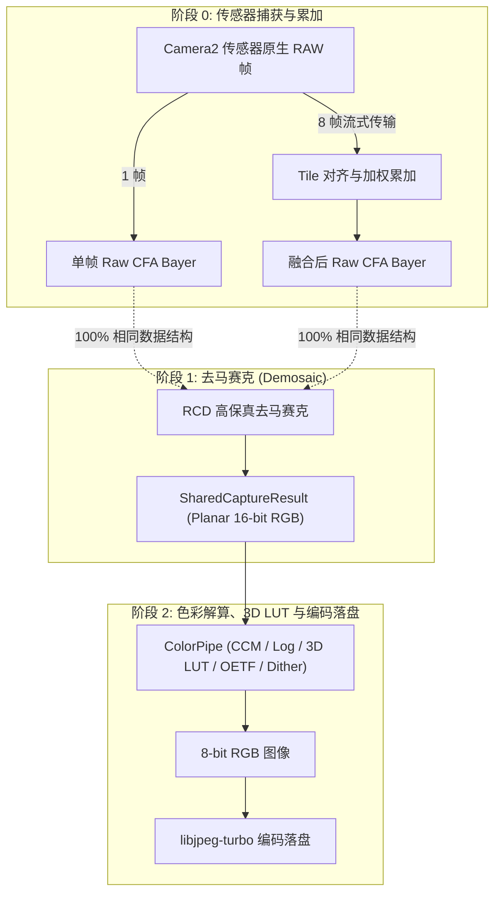
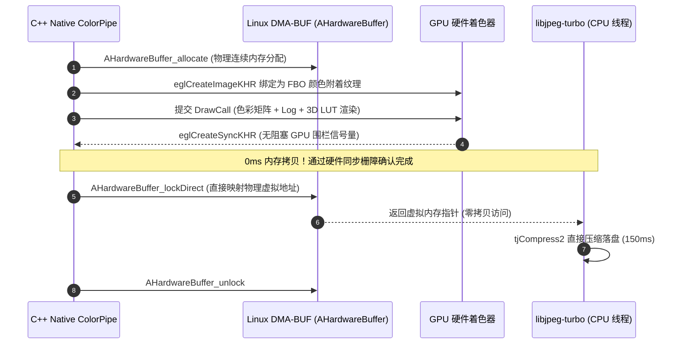
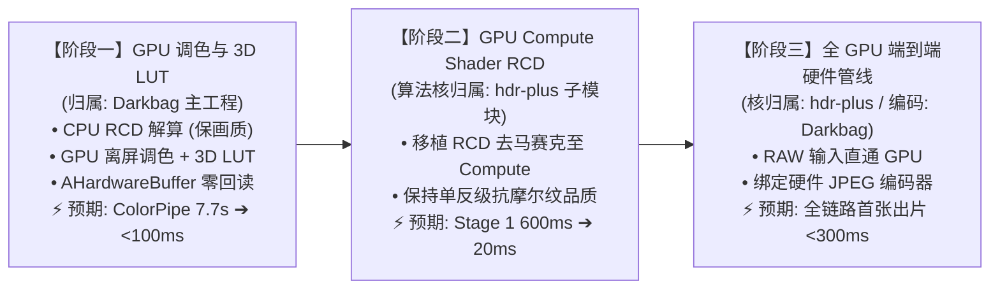

# Darkbag GPU 加速摄影计算管线架构方案 (阶段一至阶段三)

> **版本**: 1.1.0  
> **状态**: 阶段一已完成上线并经真机验证 (Commit: `8faf953a`)；阶段二进入详细方案设计阶段 (详见 [GPU_ACCELERATED_PIPELINE_PHASE2_DESIGN.md](file:///home/maary/Build/Darkbag/docs/GPU_ACCELERATED_PIPELINE_PHASE2_DESIGN.md))  
> **适用目标**: HDR+ Burst 多帧管线 & Single RAW 单帧管线  

---

## 1. 架构愿景与核心命题

### 1.1 背景与性能痛点
在 Milestone 7 的优化基准测试中，我们验证了如下关键事实：
* **无 LUT / 纯 OETF 模式**：全流程耗时极其优秀（HDR+ 8 帧出片 **5.7s**，Single RAW 出片 **3.5s**，纯解算只要 **0.6s~0.7s**）；
* **加载 3D LUT / 自定义 Log 模式**：耗时发生断崖式恶化（Single RAW 飙升至 **13.5s**，ColorPipe 单独占用 **7.7s**，HDR+ 单帧 push 被严重拖死至 **5.6s**）。

根因在于：CPU 执行 3D LUT 三线性插值需要进行 **1 亿次无序内存寻址**，极易引发 L2/L3 缓存抖动（Cache Thrashing）与内存带宽饱和，并将同进程并发执行的 DNG 编码与前台相机帧累加严重饿死。

### 1.2 核心破局思路
在移动 SoC（Snapdragon / Dimensity / Exynos）的架构中，GPU 具备专用的**硬件纹理过滤单元（Hardware Texture Mapping Unit / TMU）**与数以千计的并行着色核心。3D LUT、色域矩阵乘法、Log 对数转换与空间抖动在 GPU 硬件加速下仅需 **15ms ~ 30ms** 即可完成（相比 CPU 的 4000ms~7700ms 是 **100 倍以上**的效率跃升）。

---

## 2. Single RAW 与 HDR+ 管线的关系与复用度分析

用户关注的核心问题：**“是否考虑 single raw 的管线？二者能有多大程度的复用？”**

### 2.1 全流程数据流对比



### 2.2 复用度结论：90% ~ 100% 深度复用
1. **Stage 1 (去马赛克) 复用度: 100%**  
   无论输入来自单帧相机捕获，还是 HDR+ 8 帧融合，其输出产物均为统一规格的单层 16-bit CFA Bayer 数据。输入给 RCD Demosaic 的内存布局与尺寸完全一致。
2. **Stage 2 (调色与 3D LUT) 复用度: 100%**  
   RCD 解算输出的 `sharedResult->rgbBuf`（Planar 16-bit RGB）是 Single RAW 与 HDR+ 共同遵循的下游数据契约。Stage 2 无论是跑 CPU ColorPipe 还是切换为 GPU ColorPipe，**处理逻辑和着色代码对两者没有任何区别**。
3. **唯一的差异点**:
   仅仅是 HDR+ 多了一个“多帧流式累加（Tile Align & Merge）”的前置环节；一旦累加完成，进入 Demosaic 与调色阶段后，**代码和管线复用率为 100%**。改造 GPU 管线将使 Single RAW 与 HDR+ **同时、全量享受到极致提速**！

---

## 3. 内存回读机制：是否不可避免？

用户关注的核心问题：**“这里的内存回读是否不可避免？”**

### 3.1 移动端物理架构：统一内存架构 (UMA)
传统桌面 PC 独显通过 PCIe 总线连接 CPU，显存与系统内存物理隔离，因此 `glReadPixels` 必须通过 PCIe 总线发生跨硬件内存拷贝。  
**但在智能手机 SoC 上，CPU 与 GPU 物理上共享同一块 LPDDR5 物理内存。** 所谓“回读开销大”，纯粹是软件层使用传统的 `glReadPixels` 触发了 GPU 渲染管线强制同步阻塞（Pipeline Stall）以及逐行像素重排。

### 3.2 零拷贝（Zero-Readback）技术方案



在 Android 8.0+ (API 26+) 上，利用系统级 **`AHardwareBuffer`** 机制可以实现纯物理地址映射的**零回读架构**：
1. **共享分配**：CPU 调用 NDK `AHardwareBuffer_allocate(...)` 分配一个包含 `AHARDWAREBUFFER_USAGE_GPU_COLOR_OUTPUT` 和 `AHARDWAREBUFFER_USAGE_CPU_READ_OFTEN` 标志的硬件缓冲区；
2. **GPU 渲染**：将该 Buffer 通过 `eglGetNativeClientBufferANDROID` 挂载为 EGLImage，绑定到离屏 FBO 的颜色输出目标。GPU 着色器直接渲染写入该物理缓冲区；
3. **信号量同步**：使用轻量异步信号量 `EGLSyncKHR` 确认 GPU 渲染管线结束（仅需 1~2ms，无需死等）；
4. **零拷贝读取**：CPU 调用 `AHardwareBuffer_lock(...)` 直接拿到该缓冲区的内存首地址指针，立即传给 `tjCompress2` 进行 JPEG 压缩。
5. **结论**：**物理内存回读开销为 0ms！**

---

## 4. 三阶段演进全景路线与仓库职责映射

根据 [REPO_ARCHITECTURE_BOUNDARIES_HDRPLUS_VS_DARKBAG.md](file:///home/maary/Build/Darkbag/docs/REPO_ARCHITECTURE_BOUNDARIES_HDRPLUS_VS_DARKBAG.md) 的永久准则，全管线演进严格遵守两仓边界分工：



### 4.1 两仓职责归属速查
| 阶段与组件 | 归属仓库 | 边界理由 |
| :--- | :--- | :--- |
| **阶段一：GPU 调色与 3D LUT** | **`Darkbag`** | 胶片美学风格、EGL 离屏上下文与 AHardwareBuffer 是 Android 平台暗房宿主的核心能力，不破坏算法库的平台无关性。 |
| **阶段二：GPU Compute RCD 算法核** | **`hdr-plus`** | 去马赛克属于 RAW 图像处理通用算子，应作为现代高画质解算器合并沉淀至算法库，Darkbag 仅负责 JNI 驱动调度。 |
| **阶段三：硬件 JPEG 编码器系统对接** | **`Darkbag`** | `MediaCodec` / `ImageWriter` Surface 绑定与 MediaStore 相册入库是 Android 平台多媒体系统能力。 |


---

## 5. 【阶段一】详细技术方案设计 (当前首选实施路线)

阶段一聚焦于解决当前耗时暴增 90% 的真正根源：**3D LUT 插值与色彩空间变换**。

### 5.1 模块架构图

```
[HdrPlusProcessingService] (Kotlin 协程服务)
       │
       ▼
[exportHdrPlus] (JNI)
       │
       ├──────────────────────────────────────────────┐
       │ [选择分流]                                    │
       ▼                                              ▼
[GpuColorPipeEngine] (新模块: 默认优先)      [CpuColorPipe] (现有 ColorPipe: 兜底 Fallback)
  ├── 离屏 EGL Pbuffer / Surfaceless Context    ├── 单 Pass RGB8
  ├── 3D LUT 硬件纹理缓存 (GL_TEXTURE_3D)       ├── OpenMP 多核并发
  ├── 复用成熟的 GLSL Shader (LutSurfaceProcessor)
  └── AHardwareBuffer 零拷贝输出
       │
       ▼ (零物理拷贝指针)
[write_jpeg_turbo_fd] (libjpeg-turbo, ~150ms)
```

### 5.2 核心类接口设计 (`GpuColorPipeEngine.h`)
```cpp
namespace darkbag {
namespace gpu {

class GpuColorPipeEngine {
public:
    static GpuColorPipeEngine& instance();

    // 初始化/获取离屏 EGL 上下文 (常驻单例，避免重复初始化开销)
    bool initialize();

    // 执行 GPU 调色与 3D LUT 渲染并零拷贝导出
    bool processAndEncodeJpeg(
        const uint16_t* planarRgbData, // CPU RCD 输出的 16-bit RGB (宽*高*3)
        int width, int height,
        float digitalGain, int targetLog,
        const std::string& lutPath,
        const float* ccm, const float* wb,
        int orientation, bool mirror,
        float exposure, float contrast, float saturation,
        int colorEngineMode, bool faithfulHighlights,
        int outJpgFd, int jpegQuality,
        int64_t* outGpuRenderMs, int64_t* outJpegEncodeMs
    );

    void release();

private:
    GpuColorPipeEngine();
    ~GpuColorPipeEngine();

    bool initEgl();
    bool buildShaders();
    GLuint getOrCreateLut3DTexture(const std::string& lutPath);

    EGLDisplay eglDisplay_ = EGL_NO_DISPLAY;
    EGLContext eglContext_ = EGL_NO_CONTEXT;
    EGLConfig  eglConfig_  = nullptr;
    GLuint program_ = 0;
    std::mutex engineMutex_;
};

} // namespace gpu
} // namespace darkbag
```

### 5.3 核心实现关键细节
1. **着色器复用**：直接复用项目中在 [`LutSurfaceProcessor.kt`](file:///home/maary/Build/Darkbag/app/src/main/java/top/maary/darkbag/processor/LutSurfaceProcessor.kt#L544-L780) 已经受真机验证的 GLSL 代码（包含 OETF/EOTF、广色域矩阵、全品牌 Log 曲线、高光保护、3D LUT 半纹素校正和 TPDF 空间抖动）；
2. **3D 纹理硬件缓存**：对同一个 LUT 文件路径，将解析好的 3D 体积数据常驻在 GPU 显存（`GL_TEXTURE_3D`），同一 LUT 的后续照片直接复用已上传纹理，纹理上传开销归零；
3. **安全降级 (Fallback 策略)**：
   * 在运行时环境若检测到机型 EGL 初始化失败、`AHardwareBuffer` 创建失败或 OpenGL 异常，**自动静默降级走现有的 C++ CPU ColorPipe 路径**；
   * 确保 100% 的设备兼容性和零崩溃保障。

### 5.4 阶段一预期收益
* **ColorPipe 调色与 3D LUT 耗时**：从现在的 **3997ms ~ 7718ms** 暴降至 **60ms ~ 120ms**（包含 GPU 渲染 20ms + AHardwareBuffer 同步 2ms + libjpeg-turbo 压缩 80ms）；
* **连拍流畅度**：彻底释放 CPU 算力与内存带宽，HDR+ 连拍流式累加不再发生排队，前台快门响应恢复至极限极速；
* **单张出片时间 (T2)**：从当前的 **13.5 秒** 直接降至 **1.5 秒以内**。

---

## 6. 【阶段二】GPU Compute Shader RCD 去马赛克设计 (中期探索)

阶段二的目标是攻克 Stage 1 中占用的 **600ms~900ms** CPU 耗时。

### 6.1 RCD (Ratio-Corrected Demosaicing) 算法移植难点
RCD 相比简单双线性插值，具有无拉链效应、低伪彩、高解析度的优势，其计算分为 4 个阶段：
1. **Pass 1 (定向梯度计算)**：计算水平方向梯度 $H$ 与垂直方向梯度 $V$，以及对角线方向梯度；
2. **Pass 2 (绿通道自适应融合)**：利用水平/垂直边缘判断判别式，恢复缺失的 G 像素；
3. **Pass 3 (红蓝通道残差修正)**：利用色比（Color Ratio $R/G$ 与 $B/G$）估算 R 与 B 像素；
4. **Pass 4 (边缘自适应平滑)**：抑制孤立伪彩点。

### 6.2 GPU Compute Shader 架构
* **计算载体**：OpenGL ES 3.1+ Compute Shader 或 Vulkan Compute；
* **工作组划分**：采用 $16 \times 16$ Local Workgroup，利用 GPU 的 `shared memory`（片上高速缓存）缓存 $18 \times 18$ 包含边界 Halo 的 Tile，消除跨线程重复全局内存读取；
* **预期收益**：1200 万像素 RCD 解算耗时从 CPU 的 **600ms~900ms 压缩至 15ms~25ms**。

---

## 7. 【阶段三】全 GPU 端到端硬件计算摄影管线 (终极形态)

阶段三是追求极致出片吞吐的终极形态，将整个系统演进为完全由 GPU 与硬件加速器主导的流水线。

### 7.1 架构蓝图
1. **RAW 直通 GPU**：Camera2 通过 `ImageReader` 或直接将 RAW CFA 作为硬件纹理输入 GPU，完全绕过 CPU 内存堆栈；
2. **GPU 帧对齐与 Sabre 超分融合**：利用 Compute Shader 计算金字塔光流并进行加权融合；
3. **GPU Compute RCD**：执行去马赛克；
4. **GPU 硬件 3D LUT 调色**：输出最终渲染画面；
5. **硬件编码落盘**：GPU 直接通过 Surface 输出连接 Android 硬件 JPEG 编码器（`MediaCodec` / `ImageWriter`），硬件 ISP 直接吐出 JPEG 字节流落盘。
6. **终极收益**：**CPU 算力占用接近 0%，首张出片时间（T2）逼近 200ms ~ 300ms 极限界限。**

---

## 8. 工程重构考量与实施策略

用户关注的核心问题：**“需要考虑新建一个分支来进行实现，这可能会是一个大规模的重构动作？此外需要继续使用 subagent 团队的模式。”**

### 8.1 这是一个“大规模破坏性重构”吗？
**不是。我们可以采用“无侵入式适配器架构（Strategy Pattern）”将其设计为平滑插件：**
* 现有的 `ColorProcessor.exportHdrPlus` 保持现有的输入参数与调用接口不变；
* 在其内部通过环境判断：
  ```cpp
  if (useGpuColorPipe && GpuColorPipeEngine::instance().isAvailable()) {
      return GpuColorPipeEngine::instance().processAndEncodeJpeg(...);
  } else {
      return CpuColorPipe::processAndEncodeJpeg(...); // 原有已验证稳健逻辑
  }
  ```
* 这样的设计使得新模块完全独立在 `app/src/main/cpp/gpu/` 目录中，与主干逻辑完全解耦，随时可以一键关闭或降级，**没有任何破坏现有稳定业务的风险**。

### 8.2 分支管理策略
1. **当前分支保持纯净与交付**：当前分支 `refactor/timing-metrics-reorganization` 已圆满完成 Milestone 1~7 的所有既定目标，且在真机上验证了 3.5s (None 模式) 的突破性表现，建议将现有 PR #320 正常合并入主线；
2. **新建专用演进分支**：
   * 创建分支：`feature/gpu-accelerated-pipeline`；
   * 在该独立分支上展开阶段一的全新实现，完全隔离主线稳定性。

### 8.3 Subagent 团队协作机制
在推进此工程时，继续坚持 Subagent 团队闭环运作：
1. **Lead Orchestrator (当前 Agent)**：负责系统级设计、架构把控、接口标准化、时序打点整合与跨语言胶水代码；
2. **GPU Implementation Subagent**：负责 C++ Native EGL 上下文初始化、GLSL 着色器绑定、AHardwareBuffer 内存映射与着色指令调度；
3. **Lead Reviewer (`timing_reviewer` Subagent)**：
   * 负责严格审查 GPU 浮点计算与原 CPU 数学公式的等价性（色差校验）；
   * 审查 EGL 上下文线程安全与显存泄漏（Texture / Buffer 释放）；
   * 审查多机型/低版本设备上的安全降级机制；
   * 必须在单元测试通过与 Reviewer 给出 `[APPROVED]` 评级后方可合入。
