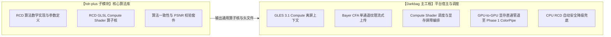
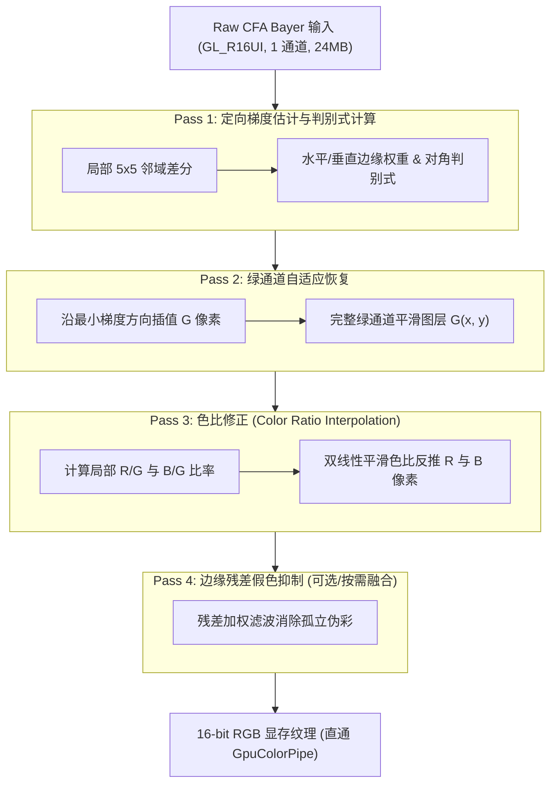
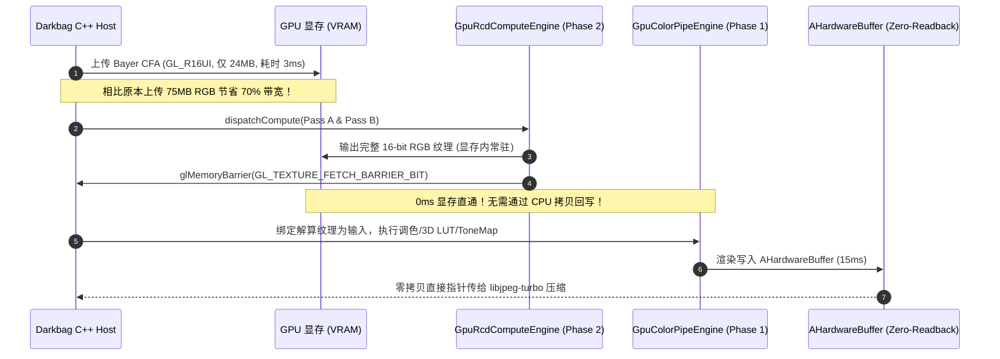

# Darkbag GPU 加速管线阶段二方案设计：GPU Compute Shader RCD 去马赛克

> **文档定位**: 阶段二 (Phase 2) 专用详细技术架构与实施规格说明书  
> **前置依赖**: 阶段一 (GPU ColorPipe & 3D LUT) 已落地并在真机验证通过 (Commit: `8faf953a`)  
> **核心目标**: 攻克 Stage 1 中占用的 **500ms ~ 900ms** CPU 去马赛克耗时，将其压缩至 **15ms ~ 25ms**  
> **适用管线**: Single RAW 单帧管线 & HDR+ Burst 多帧融合管线  
> **版本**: 1.0.0-PROPOSAL  

---

## 1. 架构定位与业务价值

### 1.1 阶段一现状与当前瓶颈
在阶段一（Phase 1）圆满落地后，Darkbag 的调色与导出耗时取得了突破性成效：
* **Stage 2 调色与 3D LUT**：由 CPU 时代的 **3997ms ~ 7718ms** 断崖式下降至 GPU 硬件着色器加速的 **155ms ~ 189ms**；
* **Single RAW 总出片时间**：由 **13.5 秒** 缩短至 **2.0 秒**。

通过真机性能采样分析，全流程瓶颈发生了关键转移：
```
========================================
[HDR+ Burst / Single RAW 耗时构成]
  [1] 传感器捕获:         191ms ~ 417ms
  [2] 并发排队等待:       10ms ~ 44ms
  [3] Stage 1 计算 (去马赛克): 514ms ~ 665ms 💥【当前最大耗时核心！】
  [4] Stage 2 导出落盘:   155ms ~ 189ms (GPU ColorPipe 已解决)
========================================
```
当前系统的第一大计算开销正是 **Stage 1 中的 RCD 去马赛克 (514ms ~ 665ms)**。本阶段的任务是将去马赛克算法全面迁移至 GPU Compute Shader，实现 Stage 1 的数量级提速。

### 1.2 阶段二预期收益
1. **解算耗时飞跃**：4096×3072 分辨率的单反级高保真去马赛克耗时由 **500ms ~ 900ms 降至 15ms ~ 25ms**（提速 **30~40 倍**）；
2. **显存内直通管道 (GPU-to-GPU Pipeline)**：
   * 阶段一目前仍需 CPU 分配 75MB 的 16-bit RGB 内存并上传至 GPU；
   * 阶段二落地后，仅需上传 24MB 的 Bayer RAW 纹理，Compute Shader 解算出的 RGB 纹理**直接在显存内部无缝流转给 Phase 1 GpuColorPipe 进行调色渲染**，彻底消灭 75MB 的 CPU 内存分配与数据回写搬移！
3. **出片总吞吐跃升**：
   * **Single RAW 首张出片耗时**：从现在的 **2002ms 压减至 350ms ~ 450ms**；
   * **HDR+ Burst 出片耗时**：从当前的 **4.8s 压减至 1.2s**（流式累加结束后几乎瞬时出片）。

---

## 2. 仓库职责与工程边界划分

严格恪守 [REPO_ARCHITECTURE_BOUNDARIES_HDRPLUS_VS_DARKBAG.md](file:///home/maary/Build/Darkbag/docs/REPO_ARCHITECTURE_BOUNDARIES_HDRPLUS_VS_DARKBAG.md) 的原则：



### 2.1 `hdr-plus` 仓库职责
1. **纯净算法核**：提供与平台解耦的 RCD GLSL Compute Shader 源码 (`rcd_demosaic.comp`) 以及头文件内嵌定义；
2. **多 Pass 算法逻辑**：忠实实现 Luis Sanz Rodriguez 的 RCD 算法数学表达（定向色度梯度、绿通道自适应恢复、色比平滑修正与残差伪彩抑制）；
3. **算法等价性测试**：建立自动化测试工具，对比 CPU RCD 与 GPU RCD 的输出像素，确保 **PSNR > 50 dB**、**SSIM > 0.999**。

### 2.2 `Darkbag` 仓库职责
1. **环境升级**：将现有的 `GpuContext` 从 GLES 3.0 升级为 **OpenGL ES 3.1+**（具备原生 Compute Shader 支持）；
2. **轻量上传**：负责分配单通道 16-bit 整数纹理 (`GL_R16UI`, 4096×3072 仅 24MB) 并上传 Bayer CFA 原始阵列；
3. **内存屏障与同步**：管理 `glMemoryBarrier(GL_TEXTURE_FETCH_BARRIER_BIT | GL_SHADER_IMAGE_ACCESS_BARRIER_BIT)` 确保读写依序；
4. **管道衔接**：Compute Shader 输出目标直接作为 Phase 1 `GpuColorPipeEngine` 的 `uTexR`, `uTexG`, `uTexB` 纹理（或打包为 `GL_RGBA16F`），实现纯显存内零拷贝直通；
5. **设备探测与降级**：若检测到设备不支持 GLES 3.1 或 Compute 失败，静默回退至 CPU RCD。

---

## 3. RCD (Ratio-Corrected Demosaicing) GPU 算法架构

RCD 具备单反级的去马赛克画质，几乎没有双线性插值的摩尔伪彩或定向插值的阶梯拉链伪影。其并行化算法解构如下：

### 3.1 算法阶段解构与 GPU Workgroup 设计



### 3.2 2-Pass 核融合策略 (Kernel Fusion)
在移动 GPU 架构中，全局显存带宽（Bandwidth）是比算力更紧缺的资源。原生 CPU 算法分为 4 个离散阶段，如果在 GPU 上调度 4 次独立 Dispatch，将产生 4 次全屏显存往返刷新。

针对 Adreno 与 Mali GPU 的片上高速缓存（Shared Memory / Local Data Share）特性，实施 **2-Pass 融合方案**：

#### Pass A: 定向梯度 + 绿通道融合 (Pass 1 + Pass 2 Fusion)
* **线程组规格**：`layout (local_size_x = 16, local_size_y = 16) in;`
* **片上共享内存**：`shared uint sBayer[20][20];`（每个 $16 \times 16$ Workgroup 协作载入外扩 2 像素 Halo 的 $20 \times 20$ 局部 Tile）；
* **计算逻辑**：
  1. 一次性将 Bayer 数据协作载入 `sBayer`，调用 `barrier()`；
  2. 在高速共享内存中完成 5×5 邻域水平梯度 $H$ 与垂直梯度 $V$ 计算；
  3. 计算定向判别式，插值生成缺失的 G 通道分量；
  4. 输出至中间图像 `imgGreen`（单通道 `GL_R16UI`）。

#### Pass B: 色比计算 + 红蓝恢复 + 残差平滑 (Pass 3 + Pass 4 Fusion)
* **输入**：原始 Bayer CFA + Pass A 产生的完整 G 通道；
* **片上共享内存**：`shared float sRatio[18][18];`
* **计算逻辑**：
  1. 每个像素已知自身精确 G 值及该位置处原生的 R 或 B 采样；
  2. 构造局部色比 $R/G$ 或 $B/G$；
  3. 协作利用局部色比进行自适应引导插值，恢复全分辨率 R 与 B；
  4. 输出直接写入终态 `GL_RGBA16F` 或 Planar `GL_R16UI` 纹理。

---

## 4. 显存直通管道设计 (GPU-to-GPU Direct Pipeline)

这是阶段二架构中最具颠覆性的性能革新：



### 4.1 核心数据结构与接口契约
在 `Darkbag` 中定义 `GpuRcdComputeEngine`：

```cpp
namespace darkbag {
namespace gpu {

class GpuRcdComputeEngine {
public:
    static GpuRcdComputeEngine& instance();

    bool initialize();
    bool isAvailable() const;

    // 执行 GPU Compute RCD 去马赛克
    // 输入: Bayer CFA 原始数据 (16-bit)
    // 输出: GPU 内部纹理 ID (可以直接传给 GpuColorPipeEngine 使用)
    bool demosaic(
        const uint16_t* bayerData,
        int width, int height,
        int cfaPattern,
        const float* blackLevel,
        float whiteLevel,
        const float* whiteBalance,
        GLuint* outTexR, GLuint* outTexG, GLuint* outTexB,
        int64_t* outComputeMs
    );

    void release();

private:
    GLuint bayerInputTex_ = 0;
    GLuint greenIntermediateTex_ = 0;
    GLuint outputTexR_ = 0;
    GLuint outputTexG_ = 0;
    GLuint outputTexB_ = 0;

    GLuint programPassA_ = 0;
    GLuint programPassB_ = 0;
    bool isInitialized_ = false;
};

} // namespace gpu
} // namespace darkbag
```

---

## 5. 安全降级机制与兼容性保障

移动端 Android 生态存在极为复杂的 GPU 芯片碎片化（Adreno, Mali, Xclipse, PowerVR）。阶段二必须具备严密的安全防御机制：

### 5.1 启动期特性探测 (Feature Probing)
在引擎初始化时执行严格的环境断言：
1. **GL 版本检查**：`glGetIntegerv(GL_MAJOR_VERSION, &major)` $\ge 3$ 且 `minor` $\ge 1$；
2. **Compute 限制探测**：
   * `GL_MAX_COMPUTE_WORK_GROUP_INVOCATIONS` $\ge 256$；
   * `GL_MAX_COMPUTE_SHARED_MEMORY_SIZE` $\ge 16384$ (16 KB，我们的 Tile 仅需约 2~4 KB)；
   * `GL_MAX_COMPUTE_IMAGE_UNIFORMS` $\ge 4$；
3. **图像格式支持**：确认驱动支持在 Compute Shader 中通过 `image2D` 进行 `GL_R16UI` 或 `GL_RGBA16F` 的写操作。

### 5.2 运行时静默降级 (Runtime Fallback)
```cpp
bool demosaicSuccess = false;
if (GpuRcdComputeEngine::instance().isAvailable()) {
    demosaicSuccess = GpuRcdComputeEngine::instance().demosaic(...);
}

if (!demosaicSuccess) {
    LOGW("GPU Compute RCD unavailable or failed, smoothly falling back to CPU RCD demosaic");
    // 降级调用原有极其稳定的 CPU RcdDemosaic::demosaic
    rcd_demosaic(...);
}
```

---

## 6. 实施路线图与里程碑拆解

| 里程碑 | 核心交付物 | 预期工期与依赖 |
| :--- | :--- | :--- |
| **Milestone 2.1**<br/>算法核移植 (`hdr-plus`) | • 编写 `rcd_pass_a.comp` 与 `rcd_pass_b.comp`<br/>• 编写离线 C++ 验证程序对比 CPU 与 GPU 像素级误差 (PSNR > 50dB) | 独立于主工程，在 `hdr-plus` 分支实施 |
| **Milestone 2.2**<br/>宿主环境升级 (`Darkbag`) | • `GpuContext` 升级支持 GLES 3.1 离屏上下文<br/>• 实现 `GpuRcdComputeEngine` 基本骨架与 Bayer 纹理上传 | 依赖 Milestone 2.1 |
| **Milestone 2.3**<br/>管道直通整合 (`Darkbag`) | • 将 Compute 输出纹理直接绑定给 `GpuColorPipeEngine`<br/>• 消除 CPU 75MB 中间缓冲分配与回写<br/>• 对接 JNI 与 `HdrPlusProcessingService` | 依赖 Milestone 2.2 |
| **Milestone 2.4**<br/>真机调优与全链路打点 | • 真机连拍压力测试、内存泄漏排查<br/>• 时序打点整合（`StandardTimingTracker` 中 Stage 1 耗时更新）<br/>• Code Review 与正式合并 | 最终验收标准 |

---

## 7. 结论与下一步行动建议

1. **阶段一评估**：阶段一（GPU 调色与 3D LUT）已经全面完成并修复了色彩矩阵与 LUT 采样缺陷，当前基线非常稳固；
2. **阶段二推进策略**：
   * 阶段二涉及跨子仓库开发（`hdr-plus` 算法核 + `Darkbag` 平台胶水）；
   * 建议先保持当前 `feature/gpu-accelerated-pipeline` 分支的纯净与稳定，确认阶段一在真机上的出片效果；
   * 随后启动阶段二 Milestone 2.1 的 Compute Shader 编写与画质精度验证。
