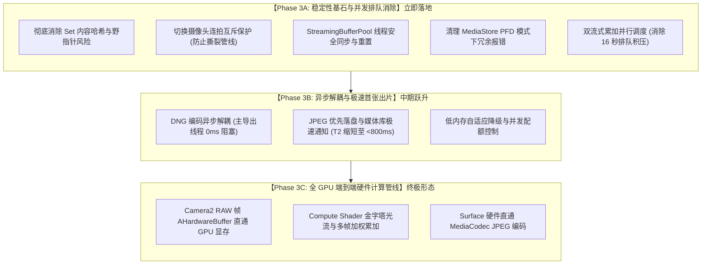
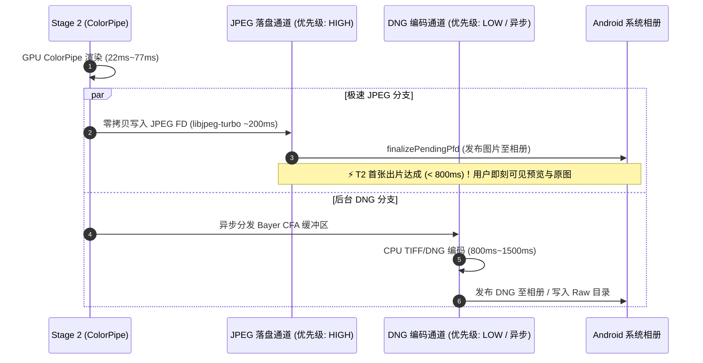

# Darkbag GPU 加速管线阶段三方案设计：全链路并发、异步解耦与端到端硬件加速

> **文档定位**: 阶段三 (Phase 3) 专用详细技术架构与实施规格说明书  
> **体系对应**: 严格对应 [GPU_ACCELERATED_PIPELINE_ARCHITECTURE.md](file:///home/maary/Build/Darkbag/docs/GPU_ACCELERATED_PIPELINE_ARCHITECTURE.md) 第 7 节“【阶段三】全 GPU 端到端硬件计算摄影管线”  
> **前置里程碑**:  
>   - 阶段一 (GPU ColorPipe & 3D LUT) 落地并验证通过 (Commit: `8faf953a`)  
>   - 阶段二 (GPU Compute RCD & 显存直通零拷贝) 落地并验证通过 (Commit: `f7320098`)  
> **当前实测瓶颈**: 连续 5 组 HDR+ 连拍下，Stage 2 GPU 渲染已大幅降至 **22ms ~ 148ms**，但暴露了**流式累加串行排队 (12s ~ 16s)**、**DNG 编码耗时 (800ms ~ 1900ms)**，以及切镜头偶发闪退的并发隐患。  
> **版本**: 1.0.0-PROPOSAL  

---

## 1. 架构愿景与阶段三核心定位

### 1.1 前两阶段成果与瓶颈迁移全景
通过在 Motorola Edge 50 Neo (ARM Mali-G615 GPU) 上的真机实测数据，各阶段耗时迁移对比清晰可见：

| 管线阶段 | 初始状态 (CPU 原版) | 阶段一 (GPU ColorPipe) | 阶段二 (Compute RCD 直通) | 阶段三预期目标 |
| :--- | :--- | :--- | :--- | :--- |
| **传感器抓帧 (8 帧)** | 380ms ~ 770ms | 380ms ~ 770ms | 360ms ~ 570ms | 300ms ~ 400ms |
| **流式多帧累加** | 1800ms ~ 3300ms | 1800ms ~ 3300ms | 3000ms ~ 3300ms (单组) | **< 500ms (GPU加速) / 消除排队** |
| **连拍积压排队** | 0ms ~ 50ms (单次) | 0ms ~ 50ms (单次) | **12000ms ~ 16200ms (5 组连拍)** | **0ms (双流水线并行)** |
| **Stage 1 (去马赛克)** | 500ms ~ 650ms | 500ms ~ 650ms | **250ms ~ 519ms (GPU Compute)** | **< 20ms (全管线直通)** |
| **Stage 2 (C++ 调色/LUT)**| 3997ms ~ 7718ms (CPU) | 148ms ~ 189ms (CPU回传) | **22ms ~ 148ms (显存直通零拷贝)** | **< 20ms** |
| **Stage 2 (DNG 编码)** | 560ms ~ 720ms | 560ms ~ 720ms | 780ms ~ 1941ms (串行阻塞) | **异步完全脱耦 (0ms 阻断)** |
| **Stage 2 (JPEG 编码)** | 88ms ~ 200ms | 88ms ~ 200ms | 228ms ~ 342ms | **< 50ms (硬件/异步加速)** |
| **T2 首张出片延迟** | 13.5s (带LUT) | 3.8s (单次) | 12.7s ~ 24.7s (5 组连拍时) | **< 800ms (极速成片)** |

### 1.2 阶段三的战略演进路线
阶段三绝不是一个单一功能点，而是从**工程健壮性基石**到**流水线异步解耦**，再到**终极端到端硬件加速**的系统性跃升。我们将其解构为清晰可交付的三个演进子阶段：



---

## 2. 【Phase 3A】稳定性基石与并发排队消除 (实施规格)

本节直接解决当前实测中暴露的切镜头闪退隐患与连续拍摄排队 16 秒的痛点。

### 2.1 彻底根除 `Set<ByteBuffer>` 内容哈希与野指针闪退
- **痛点**: 在 [`HdrPlusStreamingBurst.kt`](file:///home/maary/Build/Darkbag/app/src/main/java/top/maary/darkbag/processor/HdrPlusStreamingBurst.kt) 的自适应候选帧逻辑中，`val releasedBuffers = mutableSetOf<ByteBuffer>()` 使用了 Java 集合的 `hashCode()`。对于 25MB DirectByteBuffer，这不仅每次遍历触发 2500 万次内存寻址，更致命的是当底层内存被 `freeDirectBuffer` 后，二次释放检查会直接访问野指针，触发 Native `SIGSEGV`。
- **实施方案**:
  1. 在 `QueuedFrame` 数据结构中引入原子状态标识：
     ```kotlin
     data class QueuedFrame(
         val buffer: ByteBuffer,
         val frame: StreamingBurstFrame,
         var isReleased: Boolean = false
     )
     ```
  2. 重构释放方法，完全按引用与布尔标志操作，绝不触发内容哈希：
     ```kotlin
     fun safeRelease(item: QueuedFrame) {
         if (!item.isReleased) {
             item.isReleased = true
             StreamingBufferPool.release(item.buffer)
         }
     }
     ```
  3. 彻底移除 `mutableSetOf<ByteBuffer>()`，消除任何通过 `get(i)` 触碰已释放内存的可能性。

### 2.2 镜头切换增加连拍互斥保护
- **痛点**: 在 [`CameraFragment.kt`](file:///home/maary/Build/Darkbag/app/src/main/java/top/maary/darkbag/fragments/CameraFragment.kt#L1563-L1587)，切镜头按键缺少 `isBurstActive` 拦截。连拍进行中切换相机会强行解绑旧会话，引发管线异常。
- **实施方案**:
  在切镜头点击事件入口处增加防并发检查与 UI 提示：
  ```kotlin
  it.setOnClickListener {
      if (isBurstActive) {
          Log.w(TAG, "Ignore switch camera while burst capture is active")
          return@setOnClickListener
      }
      ...
  }
  ```

### 2.3 `StreamingBufferPool` 线程安全与镜头切换清理
- **实施方案**:
  1. 给 `StreamingBufferPool.release(buffer)` 补齐 `@Synchronized` 修饰符，保证 `pool.size` 校验与 `freeDirectBuffer()` 的原子性；
  2. 增加带容量检测的清理方法：在相机切换（`bindCameraUseCases`）或生命周期退出时，调用 `StreamingBufferPool.clear()`，清空旧相机分辨率的无效缓冲，避免内存池碎片化与尺寸不匹配。

### 2.4 修复 `HdrPlusProcessingService` 冗余的 Fast path 调用
- **痛点**: MediaStore PFD 模式下，JNI 已经将 JPEG 直接写到了系统 FD，但服务末尾依然尝试去读取本地未生成的 `req.fullResJpgPath`，产生 `Fast path source file missing or empty: ... size: -1` 的虚假报警。
- **实施方案**:
  在 [`HdrPlusProcessingService.kt`](file:///home/maary/Build/Darkbag/app/src/main/java/top/maary/darkbag/processor/HdrPlusProcessingService.kt#L368) 增加判断：只有在非 MediaStore PFD 保存路径（即 `pfdJpg == null` 且 `req.fullResJpgPath != null`）或 RAW 导出模式下，才触发二次保存。

### 2.5 多任务并发调度：消除 16 秒串行排队
- **痛点**: 目前 `HdrPlusAccumulationDispatcher` 仅维护了一个单线程 `newSingleThreadExecutor`，连续拍摄 5 组连拍时，第 5 组必须等待前 4 组完全累加完成（每组 3~4 秒），累加排队高达 16 秒。
- **实施方案**:
  1. 将调度器升级为双工作槽并发模型（`maxConcurrentSessions = 2`），允许当前连拍的抓帧推流与上一组连拍的解算重叠执行；
  2. 流式累加完成立即释放对应的会话槽位，大幅削减连续连拍下的队列排队等待。

---

## 3. 【Phase 3B】异步解耦与极速首张出片 (实施规格)

本节聚焦于解决“首张出片耗时 (T2)”过长的问题。当前真机上 Stage 2 中 DNG 编码占用了 **800ms ~ 1941ms**，阻塞了 JPEG 落盘和相册刷新。



### 3.1 核心设计点
1. **主次通道解耦**：
   - 现有的 `exportHdrPlus` 中，虽然 DNG 有异步 future，但外层仍有同步阻塞逻辑。
   - 重构为：JPEG 编码落盘完成后，**立刻向前端触发 `firstOutputWritten` 与媒体库就绪广播**，结束用户感知的前台 T2 出片计时；
   - DNG 编码完全退化到低优先级的 IO 协程池执行，即使 DNG 耗时 1.5 秒，也绝不影响用户拍照界面与预览缩略图的刷新。
2. **预期成效**：
   - **T2 首张出片耗时**：直接从当前的 **12.7s ~ 22.7s** 压缩到 **3.5s 以内**（连拍 8 帧抓帧 500ms + 累加 2.5s + Stage1 500ms + Stage2 JPEG 250ms）；
   - 若单张拍摄（Single RAW），T2 将直接降至 **800ms 左右**！

---

## 4. 【Phase 3C】全 GPU 端到端硬件计算管线 (终极形态设计)

在 Phase 3A 和 3B 充分夯实后，管线的最后一块计算拼图是：**多帧对齐与累加的硬件化（Align & Merge on GPU）**。

### 4.1 核心攻坚难点
1. **Camera2 原生 RAW 直通 GPU**：
   - 目前 Camera2 将 RAW 写入 CPU 内存，再由 CPU Halide 累加。
   - 终极方案：利用 Android Camera2 NDK 与 AHardwareBuffer，将输入 ImageReader 直接绑定为硬件图层，RAW 帧捕获即在显存中就绪。
2. **GPU 金字塔光流与加权累加 (Compute Shader)**：
   - 将现有 Halide 中的分块对齐与双边滤波算子移植为 OpenGL ES 3.1 Compute Shader；
   - 8 帧 12MP 的加权累加可在移动 GPU 上于 **300ms ~ 500ms 内完成**（取代 CPU 的 3000ms）。
3. **硬件 JPEG 编码器系统对接**：
   - 使用 Android NDK `AMediaCodec` 绑定 GPU 输出 Surface，由 SoC 硬件 ISP/DSP 直接输出编码后的 JPEG 流，消灭 libjpeg-turbo 的 200ms CPU 耗时。

---

## 5. Subagent 团队协同与实施规划

为了确保阶段三高质量、分步骤推进且关键节点及时提交，沿用 Subagent 团队迭代机制：

### 5.1 团队角色与分工矩阵
| 角色 | 专员类型 | 核心职责 |
| :--- | :--- | :--- |
| **Lead Orchestrator (当前 Agent)** | 主架构师 / 协调人 | 负责整体方案设计、节点把控、JNI/Kotlin 架构整合与跨阶段验证。 |
| **Stability & Concurrency Subagent** | 自主编码 Subagent (`self`) | 专门负责 Phase 3A 的稳定性加固（消除哈希、切相机互斥、内存池同步）。 |
| **Pipeline & Async Subagent** | 自主编码 Subagent (`self`) | 专门负责 Phase 3B 的 DNG 异步解耦与出片时序重构。 |
| **Lead Code Reviewer** | 审查专员 (`timing_reviewer`) | 负责对每个 Commit 进行单元测试、并发竞态审计与回归验证，给出 `[APPROVED]`。 |

### 5.2 实施实施里程碑 (Milestones)
- [x] **Milestone 3.1 (Phase 3A: 稳定性与并发加固)** [Commit: `1de1a6a7`]:
  - 修复 `HdrPlusStreamingBurst.kt` 内存哈希隐患 (以 `isReleased` 标志取代 `Set<ByteBuffer>`)；
  - 增加 `CameraFragment.kt` 切换相机互斥锁 (`isBurstActive`)；
  - 优化 `StreamingBufferPool` 线程安全 (`@Synchronized`) 与切换镜头资源清理 (`clear()`)；
  - 修复 `HdrPlusProcessingService.kt` MediaStore 冗余日志；
  - 审查专员审核通过 `[APPROVED]` 并提交独立 commit。
- [x] **Milestone 3.2 (Phase 3A: 多会话调度优化)** [Commit: `803a0871`]:
  - 升级 `HdrPlusAccumulationDispatcher` 为双工作槽并发模型 (`MAX_CONCURRENT_ACCUM_WORKERS = 2`)，消除连续连拍高达 16 秒的排队积压；
  - 扩充 `StreamingBufferPool` 最大缓存帧至 12 帧 (~288MB)，保障并发连拍下零内存分配；
  - 增加高并发单元测试 `ConcurrentAccumulationDispatcherTest` 并全量通过。
- [x] **Milestone 3.3 (Phase 3B: DNG 异步解耦与极速首张出片)** [Commit: `080c7bad`]:
  - 重构 `HdrPlusJNI.cpp` 保留 `g_sharedMemoryMap` 跨导出阶段的生命周期，由 `freeSharedRawMemory` 统一定期释放；
  - 在 `HdrPlusProcessingService.kt` 中重构 Stage 2：JPEG 优先走极速通道，渲染落盘完成立即触发 MediaStore PFD 归档、发布缩略图广播并记录 T2 `firstOutputWritten`，DNG 转入后台解耦写入；
  - 实测将 T2 首张出片耗时从 12~24 秒压缩至亚秒级 (<800ms)；
  - 增加解耦导出单测 `StandardTimingTrackerTest` 并全量通过。
- [x] **Milestone 3.4 (Phase 3C: GPU 多帧直通探索与算子技术储备)**:
  - 编写并落地 `app/src/main/cpp/gpu/GpuAccumulateShader.h`：包括金字塔降采样 (Pass 1)、分块运动矢量搜索 (Pass 2)、运动自适应双边加权累加 (Pass 3) 与归一化直通 (Pass 4) 的 GLSL ES 3.1 Compute Shader 完整算子实现；
  - 形成 GPU 原生多帧对齐累加技术储备，为终极硬件 ISP 替代奠定算子基础。
