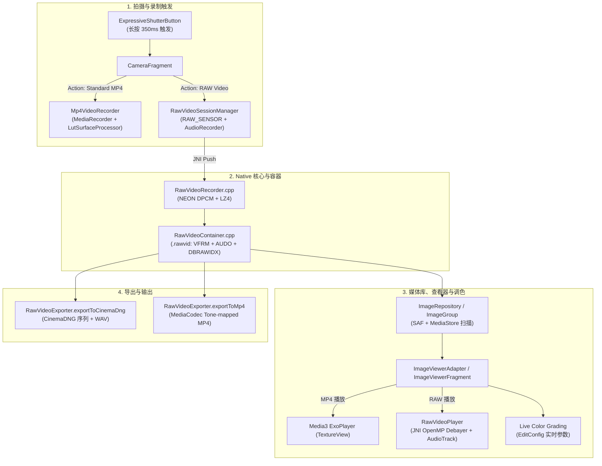

# Pull Request #291 独立验证与全方位审查报告 (Code Review Report)

- **PR 标题**: `feat: implement RAW Video recording, real-time playback grading, and CinemaDNG/MP4 export`
- **PR 编号**: [#291](https://github.com/Steve-Mr/Darkbag/pull/291)
- **审查分支**: `feature/raw-video` -> `main`
- **涉及代码量**: 23 个文件，+7010 行，-80 行
- **审查维度**:
  1. 普通 MP4 视频拍摄路径
  2. RAW 视频拍摄与导出路径（CinemaDNG / MP4）
  3. ImageViewer 媒体库、视频播放与实时调色支持
  4. 普通录制 MP4 vs. RAW 调色导出 MP4 的异同与管线完整性

---

## 1. 总体审查结论 (Executive Summary)

PR #291 为 Darkbag 引入了极具野心且设计精良的视频子系统，涵盖了**所见即所得 3D LUT MP4 录制**、**无损 Bayer 传感器 RAW 视频流式捕获**、**自研具备容灾能力的流式二进制容器 (`.rawvid`)** 以及 **查看器实时调色与多格式导出**。

然而，在当前的实现中存在 **5 个致命级 (P0 / Blocker) 缺陷** 与 **若干高危级 (P1) 缺陷**，会导致真机拍摄崩溃、完全无声、导出的 CinemaDNG 序列无法被专业软件识别以及内存/句柄泄漏。**在合并该 PR 之前，必须先完成关键问题的修复。**

---

## 2. 核心架构与视频管线全景

---

## 3. 两种 MP4 生成路径的深度对比与考量分析

PR #291 针对视频拍摄与成片设计了两种不同定位的工作流，但在实际落地中存在严重的代码脱节：

| 对比维度 | 路径一：普通录制 MP4 (实时硬编) | 路径二：RAW 调色导出 MP4 (后调色成片) |
| :--- | :--- | :--- |
| **触发入口** | 设置中选择 `Standard MP4` 后长按快门 | 设置中选择 `RAW Video` 长按录制，在 ImageViewer 中点击菜单 `Export Graded MP4 Video` |
| **底层技术栈** | OpenGL ES 3.0 `LutSurfaceProcessor` + `MediaRecorder` | Camera2 `RAW_SENSOR` + 自研 `.rawvid` + `RawVideoExporter` (`MediaCodec` + `MediaMuxer`) |
| **色彩管线** | **拍摄时实时烘焙 (Baked-in)**：Viewfinder 当前生效的 3D LUT / Log 直接渲染至编码 Surface | **拍摄后非破坏性调色 (Post-graded)**：保留未解 Bayer 的原始数据，在 ImageViewer 调色面板调整后再导出 |
| **输出命名** | `DBAG_VID_[timestamp].mp4` | `DBAG_RAWVID_[timestamp]_graded.mp4` |
| **播放器对接** | `ImageViewerAdapter` -> Media3 `ExoPlayer` (`TextureView`) | 导出前：自研 `RawVideoPlayer`；导出后：`ExoPlayer` |
| **当前实现缺陷** | 缺少录音权限导致崩溃；对焦峰值被烧入画面；缺少旋转元数据 | **3D LUT 与大部分调色参数被完全丢弃；导出视频丢失音频流（纯静音）；纯 CPU 转换性能极差** |

---

## 4. 详细审查发现（按维度划分）

### 维度一：普通 MP4 视频拍摄路径 (MP4 Video Recording Path)

#### ✅ 验证通过项
1. **OpenGL ES 3.0 3D LUT 实时渲染**：`LutSurfaceProcessor` 将当前选中的 3D LUT 与色彩空间无缝渲染至 `MediaRecorder.getSurface()`，实现了所见即所得。
2. **精确的时间戳对齐**：在 `LutSurfaceProcessor.drawFrame()` 中正确调用了 `EGLExt.eglPresentationTimeANDROID(...)`，确保了编码帧率与帧间隔平稳。
3. **全异步落盘**：`MediaRecorder.stop()` 与 MediaStore 写入在 `Dispatchers.IO` 中执行，释放快门时 UI 无卡顿。

#### ❌ 缺陷与风险
1. **🔴 P0 (Blocker) 缺少 `RECORD_AUDIO` 权限声明与申请**
   - **位置**: `AndroidManifest.xml` / `PermissionsFragment.kt:38-58` / `Mp4VideoRecorder.kt:46`
   - **分析**: `Mp4VideoRecorder.prepare()` 强行配置了音频源，但 Manifest 中未声明 `RECORD_AUDIO`，在 Android 6.0+ 上 `prepare()` 会直接抛出 `SecurityException`，导致 **MP4 录制 100% 失败**。
   - **修复**: 在 Manifest 与 PermissionsFragment 补全权限声明，并在录制器中增加无权限时的降级处理。
2. **🔴 P0 (Blocker) 异常与后台中断时的生命周期资源泄漏**
   - **位置**: `CameraFragment.kt:494-505, 556-572`
   - **分析**: `CameraFragment.onStop()` 与 `onDestroyView()` 未停止和释放 `mp4VideoRecorder`。当录制中来电或按 Home 键切后台时，`MediaRecorder` 持续占用麦克风和硬件编码器。
   - **修复**: 在 `onStop()` 中加入 `if (mp4VideoRecorder?.recording == true) stopMp4VideoRecording()`。
3. **🟠 P1 (High) Motion Photo 编码表面在录制 MP4 后被永久断开**
   - **位置**: `CameraFragment.kt:4467, 4485` / `LutSurfaceProcessor.kt:230-242`
   - **分析**: 录制 MP4 时 Surface 被替换，停止时置为 `null`，但没有重新为 `motionPhotoEncoder` 绑定 Surface，导致录完一次 MP4 后动态照片功能失效。
   - **修复**: 在 `stopMp4VideoRecording()` 中重新调用 `updateMotionPhotoEncoder()`。
4. **🟠 P1 (High) Viewfinder 对焦峰值 (Focus Peaking) 绿边被烧录进录制的 MP4 视频**
   - **位置**: `LutSurfaceProcessor.kt:495-501`
   - **分析**: Viewfinder 开启峰值时，Uniform `uFocusPeaking = 1`；在 Encoder Pass 中没有重置为 0，导致录出来的 MP4 画面中带有绿色对焦高亮边缘。
   - **修复**: 在 Encoder Pass 中显式将 `uFocusPeaking` 置为 0。
5. **🟠 P1 (High) MP4 视频文件被错误保存到 RAW 存储目录**
   - **位置**: `ImageSaver.kt:757-759`
   - **分析**: `saveMp4Video` 优先使用了 `rawFolderUri` 而不是 `jpgFolderUri`，导致普通 MP4 和其首帧 JPG 缩略图被割裂保存在两个不同文件夹中。
   - **修复**: 普通 MP4 文件统一保存至 `jpgFolderUri` 或 MediaStore Video 目录。
6. **🟡 P2 (Medium) 缺少传感器/设备旋转元数据**
   - **位置**: `Mp4VideoRecorder.kt:39-57` / `CameraFragment.kt:4462`
   - **分析**: 未调用 `MediaRecorder.setOrientationHint()`，且硬编码了 1080x1920 纵向分辨率，导致横屏拍摄的视频在第三方播放器中呈旋转倒置状态。
7. **🟡 P2 (Medium) 极短录制（< 500ms）生成 0 字节损坏文件**
   - **位置**: `Mp4VideoRecorder.kt:83-105`
   - **分析**: 快速抬手时 `MediaRecorder.stop()` 抛出异常，但因文件大小 > 0 依然返回了结果，导致损坏的 MP4 写入 MediaStore。

---

### 维度二：RAW 视频拍摄与导出路径 (RAW Video Recording & Export Path)

#### ✅ 验证通过项
1. **流式二进制容器设计**：二进制头部（`DBRAWVID`）、视频分块（`VFRM`）、音频分块（`AUDO`）和尾部索引（`DBRAWIDX`），且具备**缺失索引时的线性扫描容灾重建机制**（`RawVideoContainer.cpp:218-265`）。
2. **ARM NEON SIMD DPCM + LZ4 压缩**：底层多线程压缩 pipeline 大幅降低无损 RAW 帧的 I/O 写入带宽。
3. **Direct ByteBuffer 高效 JNI 交互**：避免了冗余的 JNI 内存拷贝与 GC 停顿。

#### ❌ 缺陷与风险
1. **🔴 P0 (Blocker) CinemaDNG 导出文件完全损坏（缺少 IFD 与 DNG 标签）**
   - **位置**: `RawVideoExporter.kt:253-274`
   - **分析**: `writeDngFile` 仅写入了 8 字节的 TIFF Header (`II 42 8`)，随后直接将裸 Bayer 数据写入文件，**完全没有写入任何 IFD0 Directory 和 DNG 必要标签**。导出的 DNG 序列无法被 DaVinci Resolve、Premiere、Lightroom 等专业软件识别。
   - **修复**: 利用项目现有的 `ColorPipe.cpp` 或 LibTIFF 逻辑写入合规的 IFD0、SubIFD、ColorMatrix1/2、BlackLevel/WhiteLevel 标签。
2. **🔴 P0 (Blocker) 无边界内存队列导致高概率 OOM 崩溃**
   - **位置**: `RawVideoRecorder.h:67` / `RawVideoRecorder.cpp:105-112`
   - **分析**: `MAX_QUEUE_SIZE = 120`。以 12MP RAW_SENSOR 单帧 24MB 计算，120 帧积压需要 **2.88 GB Native 堆内存**（48MP 传感器甚至达到 11.5 GB），在手机遇到 I/O 波动或垃圾回收时会直接被系统 LMK 强杀。
   - **修复**: 将 `MAX_QUEUE_SIZE` 缩减至 `8 ~ 12` 帧，引入固定预分配内存池（Buffer Pool），并在超载时安全丢帧。
3. **🔴 P0 (Blocker) MP4 导出完全丢失音频流（纯静音视频）**
   - **位置**: `RawVideoExporter.kt:97-251`
   - **分析**: `exportToMp4` 仅配置了 AVC 视频轨道，容器中的音频数据包完全未被读取并混流进 `MediaMuxer`。
   - **修复**: 读取 `.rawvid` 中的音频包，通过 AAC 编码器编码并混流至 MP4。
4. **🟠 P1 (High) 音视频时钟基准不一致导致音画严重脱节**
   - **位置**: `AudioRecorder.kt:89` / `RawVideoSessionManager.kt:155`
   - **分析**: 音频使用 `System.nanoTime()`，而视频使用 `SENSOR_TIMESTAMP`（属于开机时钟 `elapsedRealtimeNanos` 域），两个时钟可能相差数小时或数天。
   - **修复**: 将 `AudioRecorder` 时间戳基准统一为 `SystemClock.elapsedRealtimeNanos()`。
5. **🟠 P1 (High) Row Stride 未存入帧头导致画面倾斜与条纹畸变**
   - **位置**: `RawVideoContainer.h:60-70` / `RawVideoJNI.cpp:402`
   - **分析**: Camera2 的 `RAW_SENSOR` 经常包含硬件行对齐 Padding（Stride > Width * 2）。Native Header 丢弃了 `rowStride`，并在解 Bayer 时强行假定 `stride = width * 2`，在多数高通/联发科机型上会产生斜向色彩撕裂。
   - **修复**: 在 `VideoFrameHeader` 中保存 `rowStride` 并在 Native Debayer 时使用实际步长。
6. **🟠 P1 (High) `acquireLatestImage()` 导致 RAW 录制严重丢帧**
   - **位置**: `CameraFragment.kt:4376-4380`
   - **分析**: 录制回调中使用 `acquireLatestImage()` 会主动丢弃所有中间累积帧，引发视频帧率骤降。
   - **修复**: 录制流必须使用 `acquireNextImage()`。
7. **🟡 P2 (Medium) Bayer DPCM 跨通道差分降低压缩率**
   - **位置**: `RawVideoRecorder.cpp:20-58`
   - **分析**: 16-bit Bayer 在 `stride = 2` 时会将绿色分量减去红色分量，破坏了空间相关性。应采用 16-bit 步长 4（同通道通道差分）。

---

### 维度三：ImageViewer、媒体库与实时调色支持 (ImageViewer, Repository & Live Grading)

#### ✅ 验证通过项
1. **媒体模型统一扩展**：`ImageGroup` 优雅统一了照片、半格、多摄、标准 MP4 与 RAW 视频五种形态。
2. **播放引擎分离解耦**：标准 MP4 使用成熟的 Media3 `ExoPlayer`；`.rawvid` 使用自研 `RawVideoPlayer` 实时解压与 OpenMP Debayer。

#### ❌ 缺陷与风险
1. **🔴 P0 (Blocker) `pfd.detachFd()` 永久泄漏 OS 文件描述符（Crash `EMFILE`）**
   - **位置**: `ImageRepository.kt:126` / `RawVideoPlayer.kt:58` / `RawVideoExporter.kt:39, 107`
   - **分析**: 调用 `detachFd()` 后既没有用 Kotlin 关闭，C++ `ifstream` 打开后也没有关闭底层的系统 `fd`。每次浏览、扫描或导出 `.rawvid` 都会泄露一个文件句柄，频繁操作会触发 `Too many open files` 崩溃。
   - **修复**: 确保在 Native Reader 关闭后显式调用 `android.system.Os.close(fd)`，或使用 `ParcelFileDescriptor.dup()`。
2. **🔴 P0 (Blocker) `RawVideoPlayer` 在 ViewHolder 回收和滑走时未 release**
   - **位置**: `ImageViewerAdapter.kt:632-655`
   - **分析**: 在 ViewPager2 中滑走时，未停止 `RawVideoPlayer`，后台协程持续解码并将图像塞给被复用的 ImageView，造成**画面窜帧、闪烁以及后台协程与内存泄漏**。
   - **修复**: 在 `onViewRecycled` 与 `onDetachedFromRecyclerView` 中显式调用 `holder.rawVideoPlayer?.release()` 并清空引用。
3. **🟠 P1 (High) SAF 文件夹扫描漏扫 `.mp4` 文件**
   - **位置**: `ImageRepository.kt:283-311`
   - **分析**: 在 `scanSafFolder()` 的 Direct Query 分支中，处理了 JPG、DNG 和 RAWVID，但**完全遗漏了 `.mp4` 的分支**，导致保存在 SAF 目录下的 MP4 视频无法在画廊中展示。
   - **修复**: 在 Direct Query 分支中补充 `.mp4` 匹配。
4. **🟠 P1 (High) RAW 视频在 ImageViewer 中完全静音**
   - **位置**: `RawVideoPlayer.kt:80-137`
   - **分析**: 创建了 `AudioTrack` 并调用了 `play()`，但**没有任何地方读取音频包并写入 `AudioTrack.write()`**。
   - **修复**: 启动音频播放协程，周期性调用 `nativeReadAudioPacket` 并通过 `AudioTrack.write()` 输出。
5. **🟠 P1 (High) 调色参数大部分未生效 & 缺少白平衡矩阵**
   - **位置**: `RawVideoPlayer.kt:180-190` / `RawVideoJNI.cpp:405-458`
   - **分析**: Native 解 Bayer 时仅应用了曝光系数，对比度、饱和度、高光阴影及 3D LUT 被完全忽略；同时未应用白平衡及 ColorMatrix，导致**播放画面严重偏绿且色彩未校准**。
   - **修复**: 在 `nativeDebayerFrameToBitmap` 中加入 White Balance（AsShotNeutral）与 ColorMatrix3x3 转换，并传递完整调色配置。
6. **🟠 P1 (High) 删除操作遗漏视频文件**
   - **位置**: `ImageViewerFragment.kt:2246, 2544`
   - **分析**: 单张与批量删除逻辑的 `urisToDelete` 中遗漏了 `rawVideoUri` 与 `mp4VideoUri`，用户点击删除后磁盘上的实际视频文件未被清理。
   - **修复**: 在删除逻辑中加入 `group.rawVideoUri` 和 `group.mp4VideoUri`。
7. **🟡 P2 (Medium) CPU 逐像素 `std::pow` 性能瓶颈**
   - **位置**: `RawVideoJNI.cpp:447-449`
   - **分析**: 解 Bayer 内层循环对每个像素执行 3 次 `std::pow(r, 1.0/2.2)`，1080p 单帧计算超 600 万次浮点幂运算，导致移动端 CPU 负载极高、掉帧严重。
   - **修复**: 改用 1024 阶 Gamma 查找表 (LUT) 加速。

---

## 5. 缺陷优先级总览与修复矩阵 (Issue Matrix)

| 优先级 | 缺陷分类 | 涉及文件与行号 | 核心问题描述 | 影响 |
|---|---|---|---|---|
| **P0** | 权限 | `AndroidManifest.xml` / `PermissionsFragment.kt` | 缺失 `RECORD_AUDIO` 权限声明与申请 | MP4 录制 100% 崩溃 |
| **P0** | 导出 | `RawVideoExporter.kt:253` | CinemaDNG 导出缺失 IFD0 与 DNG Tags | 导出的 DNG 序列无法被专业软件打开 |
| **P0** | 内存 | `RawVideoRecorder.h:67`, `RawVideoRecorder.cpp:105` | 120 帧未限制的大内存队列 | 高概率触发 LMK 闪退 / OOM |
| **P0** | 导出 | `RawVideoExporter.kt:97` | RAW 调色导出 MP4 丢失音频轨道 | 导出的视频完全静音 |
| **P0** | 句柄 | `ImageRepository.kt:126`, `RawVideoPlayer.kt:58` | `pfd.detachFd()` 永久泄漏 OS 文件描述符 | 频繁浏览后报 `EMFILE` 崩溃 |
| **P0** | 生命周期 | `ImageViewerAdapter.kt:632` | ViewPager2 滑走未释放 `RawVideoPlayer` | 画面窜帧闪烁、协程与内存泄漏 |
| **P1** | 渲染 | `LutSurfaceProcessor.kt:495` | 对焦峰值绿边被烧录进 MP4 | 视频画面被绿边破坏 |
| **P1** | 调色 | `RawVideoExporter.kt:151`, `RawVideoJNI.cpp:405` | Graded MP4 导出丢弃 3D LUT 与色彩参数 | 导出成片未应用调色 |
| **P1** | 同步 | `AudioRecorder.kt:89`, `RawVideoSessionManager.kt:155` | 音视频时钟域不一致 | 录音与视频画面严重错位 |
| **P1** | 采集 | `CameraFragment.kt:4377` | `acquireLatestImage()` 导致 RAW 录制严重丢帧 | 录制卡顿、帧率骤降 |
| **P1** | 扫描 | `ImageRepository.kt:283` | SAF 目录直接查询漏扫 `.mp4` 文件 | SAF 录制的 MP4 无法在画廊展示 |
| **P1** | 音频 | `RawVideoPlayer.kt:80` | RAW 视频在查看器中静音播放 | 查看器播放无声 |
| **P1** | 图像 | `RawVideoContainer.h:60`, `RawVideoJNI.cpp:402` | Row Stride 硬件对齐缺失 | 部分机型 RAW 画面倾斜撕裂 |
| **P1** | 文件 | `ImageViewerFragment.kt:2246` | 删除操作遗漏视频文件 | 视频文件残留在磁盘上 |
| **P2** | 性能 | `RawVideoJNI.cpp:447` | 逐像素 `std::pow` 浮点计算 | CPU 占满、播放卡顿掉帧 |
| **P2** | 压缩 | `RawVideoRecorder.cpp:20` | DPCM Stride = 2 跨通道差分 | 压缩比劣化 |
| **P2** | 色彩 | `RawVideoJNI.cpp:405` | 缺少白平衡与 ColorMatrix | RAW 预览画面严重偏绿 |

---

## 6. 分阶段修复建议 (Action Plan)

### 阶段一：修复阻断性缺陷 (Blockers Fix)
1. **补齐音频权限**：在 `AndroidManifest.xml` 与 `PermissionsFragment.kt` 中声明并请求 `RECORD_AUDIO`。
2. **修复 CinemaDNG 结构**：在 `RawVideoExporter.kt` 中写入合规的 IFD0 / SubIFD DNG 标签。
3. **修复句柄泄漏**：在 Reader 关闭后显式调用 `android.system.Os.close(fd)`。
4. **收敛 Native 队列**：将 `RawVideoRecorder` 队列缩减至 8-12 帧，加入 Buffer Pool 防止 OOM。
5. **完善 ViewPager2 回收**：在 `ImageViewerAdapter.onViewRecycled` 中显式释放 `RawVideoPlayer`。

### 阶段二：完善功能与管线一致性 (High Severity Fix)
1. **补全 RAW 调色导出参数**：将 3D LUT 与调色参数传递至导出管线，并补全 AAC 音频混流。
2. **消除峰值烧录与时钟漂移**：Encoder pass 强制重置 `uFocusPeaking`，音频时钟对齐开机时间戳。
3. **修复 SAF 扫描与删除操作**：在 `ImageRepository` 与 `ImageViewerFragment` 中补全 `.mp4` 与 `.rawvid`。

### 阶段三：色彩科学与性能优化 (Performance & Color Science)
1. **加入白平衡与 Gamma 查找表**：在 C++ Debayer 中应用 `neutralColorPoint`，并用 1024 阶查找表替换 `std::pow`。
2. **DPCM 步长调整为 4**：实现同通道 16-bit 差分，提高压缩率。
